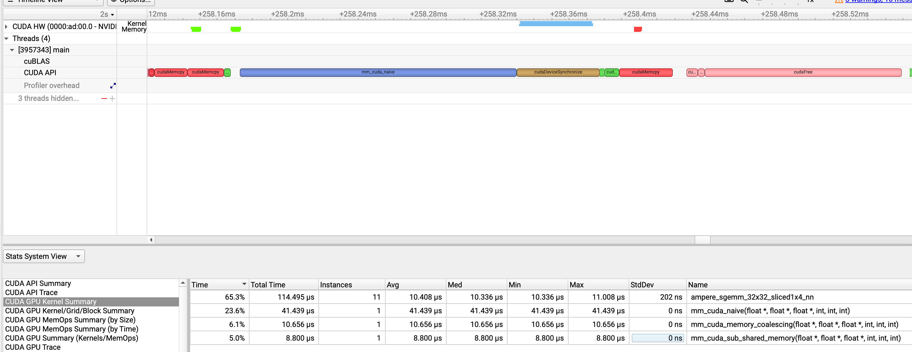
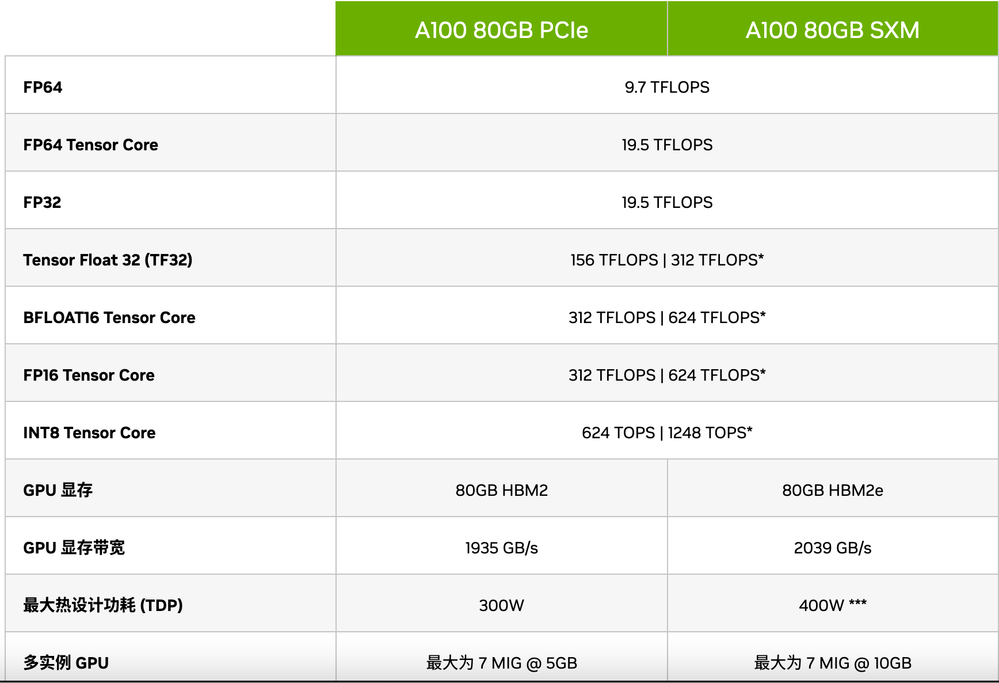
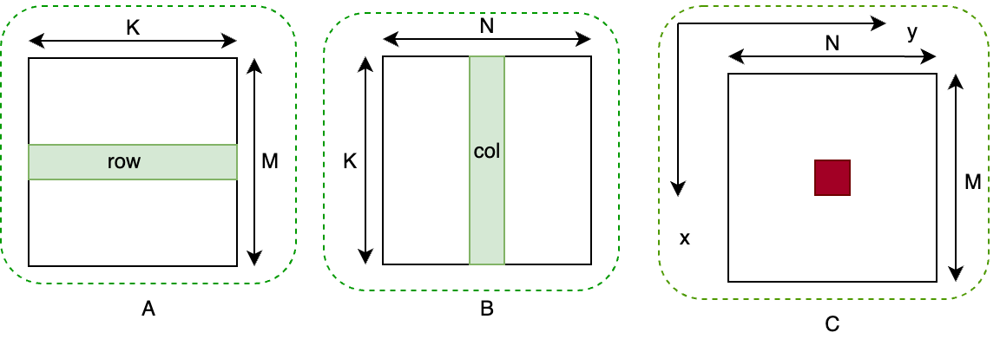
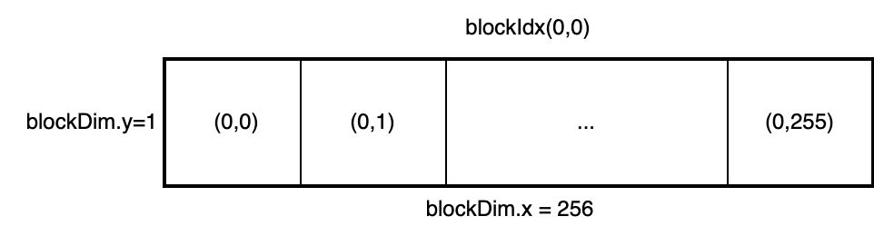

# Matmul

参考资料：
https://siboehm.com/articles/22/CUDA-MMM

## build and run

```shell
nvcc main.cc mm*.cc *.cu -o main -lcublas -L/share/cuda/lib64
./main 100 100 100  # M N K
```

install cublas if build with matmul_cublas.cu

## 基础性能分析
nsys运行得到perf文件:
```shell
nsys profile -o timeline --trace=cuda,nvtx,cudnn,cublas --force-overwrite true --stats=true ./main 100 100 100
```
A100下输出如下:

```
WARNING: CPU IP/backtrace sampling not supported, disabling.
Try the 'nsys status --environment' command to learn more.

WARNING: CPU context switch tracing not supported, disabling.
Try the 'nsys status --environment' command to learn more.

4
M, N, K: 100, 100, 100
cpu time for matrix [100, 100, 100] is 2876 ms.
cuda mm cublas time for [100, 100, 100] is 0.012973 ms.
cublas:  mse error is 2.91285e-10
cuda mm naive time for [100, 100, 100] is 0.206784 ms.
grid x 7 7 256 1
cuda mm gpu memory coalescing time for [100, 100, 100] is 0.134592 ms.
cuda submatrix for [100, 100, 100] is 0.129024 ms.
Generating '/workspace/nsys-report-a97f.qdstrm'
[1/7] [========================100%] timeline.nsys-rep
[2/7] [========================100%] timeline.sqlite
[3/7] Executing 'nvtxsum' stats report

 Time (%)  Total Time (ns)  Instances    Avg (ns)      Med (ns)     Min (ns)    Max (ns)   StdDev (ns)   Style           Range
 --------  ---------------  ---------  ------------  ------------  ----------  ----------  -----------  -------  ----------------------
     90.0       44,178,299          1  44,178,299.0  44,178,299.0  44,178,299  44,178,299          0.0  PushPop  cuBLAS:cublasCreate_v2
     10.0        4,910,172         11     446,379.3       6,634.0       6,058   4,838,977  1,456,860.6  PushPop  cuBLAS:cublasSgemm_v2

[4/7] Executing 'cudaapisum' stats report

 Time (%)  Total Time (ns)  Num Calls    Avg (ns)    Med (ns)  Min (ns)   Max (ns)    StdDev (ns)                       Name
 --------  ---------------  ---------  ------------  --------  --------  -----------  ------------  ---------------------------------------------
     86.4      278,369,923          8  34,796,240.4   1,259.0       613  278,362,164  98,415,495.0  cudaEventCreate
      6.5       20,865,050         15   1,391,003.3   8,849.0     2,632   20,232,885   5,212,868.7  cudaMalloc
      5.3       17,091,608         17   1,005,388.7   5,851.0     3,582   12,762,601   3,097,406.5  cudaFree
      1.4        4,599,006         12     383,250.5     448.0       430    4,593,214   1,325,794.7  cudaOccupancyMaxActiveBlocksPerMultiprocessor
      0.1          468,853         14      33,489.5   4,340.0     3,423      156,975      54,603.3  cudaLaunchKernel
      0.1          385,053        768         501.4     485.5       127        5,980         478.3  cuGetProcAddress
      0.1          331,507         12      27,625.6  21,790.5    13,220       45,738      11,012.3  cudaMemcpy
      0.0           82,498          7      11,785.4   6,979.0     2,239       46,890      15,982.3  cudaDeviceSynchronize
      0.0           81,715          4      20,428.8   8,243.5     8,097       57,131      24,468.5  cudaEventSynchronize
      0.0           24,207          8       3,025.9   2,619.0     2,278        6,079       1,254.6  cudaEventRecord
      0.0           10,455         18         580.8     379.0       363        3,316         690.0  cudaEventCreateWithFlags
      0.0            8,019          2       4,009.5   4,009.5     1,015        7,004       4,234.9  cuInit
      0.0            7,428         18         412.7     339.5       309        1,270         224.6  cudaEventDestroy
      0.0            5,426          3       1,808.7     803.0       179        4,444       2,303.5  cuModuleGetLoadingMode

[5/7] Executing 'gpukernsum' stats report

 Time (%)  Total Time (ns)  Instances  Avg (ns)  Med (ns)  Min (ns)  Max (ns)  StdDev (ns)     GridXYZ         BlockXYZ                                    Name
 --------  ---------------  ---------  --------  --------  --------  --------  -----------  --------------  --------------  -------------------------------------------------------------------
     65.3          114,495         11  10,408.6  10,336.0    10,336    11,008        202.4     4    4    1   128    1    1  ampere_sgemm_32x32_sliced1x4_nn
     23.6           41,439          1  41,439.0  41,439.0    41,439    41,439          0.0     4    4    1    32   32    1  mm_cuda_naive(float *, float *, float *, int, int, int)
      6.1           10,656          1  10,656.0  10,656.0    10,656    10,656          0.0     7    7    1   256    1    1  mm_cuda_memory_coalescing(float *, float *, float *, int, int, int)
      5.0            8,800          1   8,800.0   8,800.0     8,800     8,800          0.0     7    7    1    16   16    1  mm_cuda_sub_shared_memory(float *, float *, float *, int, int, int)

[6/7] Executing 'gpumemtimesum' stats report

 Time (%)  Total Time (ns)  Count  Avg (ns)  Med (ns)  Min (ns)  Max (ns)  StdDev (ns)      Operation
 --------  ---------------  -----  --------  --------  --------  --------  -----------  ------------------
     72.4           43,904      8   5,488.0   5,488.0     5,184     5,856        208.1  [CUDA memcpy HtoD]
     27.6           16,767      4   4,191.8   4,128.0     3,904     4,607        335.2  [CUDA memcpy DtoH]

[7/7] Executing 'gpumemsizesum' stats report

 Total (MB)  Count  Avg (MB)  Med (MB)  Min (MB)  Max (MB)  StdDev (MB)      Operation
 ----------  -----  --------  --------  --------  --------  -----------  ------------------
      0.320      8     0.040     0.040     0.040     0.040        0.000  [CUDA memcpy HtoD]
      0.160      4     0.040     0.040     0.040     0.040        0.000  [CUDA memcpy DtoH]

Generated:
    /workspace/cudac/matmul/timeline.nsys-rep
    /workspace/cudac/matmul/timeline.sqlite
```
使用nsight system分析文件：


将维度增加到M=K=N=4096后  
```shell
 Time (%)  Total Time (ns)  Instances    Avg (ns)       Med (ns)      Min (ns)     Max (ns)    StdDev (ns)     GridXYZ    BlockXYZ                                    Name
  --------  ---------------  ---------  -------------  -------------  -----------  -----------  -----------  --------------  --------------  ------------------------------------------------------------------- 
     72.5      470,706,229          1  470,706,229.0  470,706,229.0  470,706,229  470,706,229          0.0   128  128    1    32   32    1  mm_cuda_naive(float *, float *, float *, int, int, int)
     14.9       96,915,590         11    8,810,508.2    8,809,763.0    8,806,915    8,817,348      3,031.1    32   64    1   128    1    1  ampere_sgemm_128x64_nn
      8.1       52,392,279          1   52,392,279.0   52,392,279.0   52,392,279   52,392,279          0.0   256  256    1   256    1    1  mm_cuda_memory_coalescing(float *, float *, float *, int, int, int)
      4.5       29,104,375          1   29,104,375.0   29,104,375.0   29,104,375   29,104,375          0.0   256  256    1    16   16    1  mm_cuda_sub_shared_memory(float *, float *, float *, int, int, int)
```
可以明显看出cubals(ampere_sgemm_128x64_nn)是最快的，只需要8ms。而写的最简单的mm_naive需要470ms....

## 计算GFLOPS
#### 基础信息
1GFLOPS = 10 ^ 9 FLOPS  
1TFLOPS = 1000 GFLOPS  
FLOPS表示每秒所执行的浮点运算次数。

A100-SXM4-80GB理论数据:


80G的GPU显存可用
Memory bandwidth: 2039 GB/s = 2039 M/ms  
fp32 compute throughput: 156 TFLOPs = 156000 GFLOPS  
bandwidth指理论上单位时间可以传输的数据量。  

### 理论计算
说明:

A: [M, K], B[K, N], C[M, N]  
C = A * B

先看有多少计算量呢？矩阵乘法，一行想乘相加得到一个数，这样得到一个数是（K+ (K-1)）个计算量（K个数乘法，K-1个加法），则一整个矩阵乘法compute flops = M * (K + (K - 1)) * N  
再看需要有多少存储需要加载拷贝到gpu上呢？计算下矩阵大小(float type):  
gpu memory = M * K * 4B + K * N * 4B + M * N * 4B

所以对于M=K=N=4096的矩阵计算量和拷贝字节大小:  
gpu memory = 4096 * 4096 * 4 + 4096 * 4096 * 4 + 4096 * 4096 *4 = 192 M  
compute flops  = 4096* (4096 + 4095) * 4096 = 137 GFLOP  

则A100上理论计算数据如下:  
理论最快拷贝时间 =  192 / 2039 = 0.09416 ms.即192M的数据需要0.094ms的时间完成cpu到gpu的拷贝。  
理论最快计算时间 = 137 / 156000 * 1000 = 0.878 ms  

理论计算时间远远大于数据拷贝时间，所以当前算子应该是compute-bound计算瓶颈的。

实测部分数据throughput分析如下:  
实际数据拷贝时间(根据nsys文件)：68us或者80us，和理论数据接近，但是为啥会快点？  
吞吐计算:    
吞吐throughput=实际计算总量/实际计算时间。  
以mm_cuda_naive为例子，实际计算量为(137 * 10 ^ 9) FLOPS , 实际A100运行时间470ms(0.47s)  
mm_cuda_naive_throughput =  (137 * 10 ^ 9) FLOPS / (0.47s) = 291 GFLOPS  
mm_cuda_memory_coalescing_throuthput = 137 GFLOPS / 55 ms = 2.4 TFLOS
mm_cuda_sub_shared_memory_throughput = 137 GFLOPS / 29 ms = 4.7 TFLOS
cublas_ampere_sgemm_32x32_sliced1x4_nn_throughput = 137 / 8.8 * 1000 = 113.4 TFLOPS  

可以看出A100上理论fp32最大throughput为156TFLOPS,而cubls的计算能力基本快达到理论上限为113TFLOPS。

## 算子优化
### naive方法
如图，矩阵A: [M, K], B[K, N],矩阵乘结果C[M, N]。最直接的想法就是用A的一行乘上B的一列然后得到C中一个元素。这样遍历完所有的A的行和B的所有列就可以计算出所有C中的元素。kernel上启一个2纬的grid和block。一个x线程取A的一行元素计算，一个y线程取B的一列计算。

这种计算的实测throughput为289GFLOPS，只有理论上限的1%左右，利用率特别低。主要原因是： 
1. 重复的内存读取
假设BLOCK_SIZE是16,则一个dimBlock里就有16 * 16个独立线程。thread id是(0, 0), (0, 1), ....(0, 15), (1, 0), ...(15, 15)。对线程组合(0, 0),naive的读取方式是用读取A的第0行和B的第0列。对thread(0, 1)则读取A的0行和B的1列。可以看出一个dimBlock里就对A的每一行都重复读取了16次。B也是。从global memory到shared memory的读取是很慢的。这种重复读取造成了极大的消耗。

2. 内存读取线程不连续
   内存读取不连续的含义是相邻的线程在读取global memory数据的时候不是读取的相邻的位置。还是以一个dimBlock的线程为例子，naive方法中相邻的线程(0,0),(0,1)...对应到A中就是第一个线程读取第一行，第二个线程读取第二行。假设两个线程是同时并行读取的，则读取的数据就是A[0,0]和A[1,0]两个元素，而这两个元素在A的内存上不是相邻的。一般A的存储肯定是A[0,0]和A[0,1]是相邻的。gpu在设计时从global memory中读取数据是遵循SIMD的，即单个指令执行多个数据，为了加速硬件读取的效率，从硬件上读取数据时一条读取指令会将返回一段内存的数据而不是只返回一个位置的数据。所以如果是按照A[0,0],A[1,0]这种读取的话，读取16个数据则需要16次硬件指令才能获取所有的数据，而且造成了很多数据的读取浪费。但是如果按照A[0,0],A[0,1]这种顺序读取数据的话由于是连续的，可能只需要一次的硬件指令就可以满足把16个数据读取出来。具体查看官网gpu global memory coalescing的介绍。

### global memory coalescing
根据naive的限制条件中内存读取不连续问题，可以将内存读取改成连续的版本。即相邻的线程让其读取的buffer是连续的。改变dimGrid和dimBlock如下，第一个dimBlock为(假设BLOCK_SIZE=16):

改变读取行列顺序:
```cuda
  const int row = blockIdx.x * BLOCK_SIZE + (threadIdx.x / BLOCK_SIZE);
  const int col = blockIdx.y * BLOCK_SIZE + (threadIdx.x % BLOCK_SIZE);
```
对第一个dimBlock来说，前面16个线程组合(0,0)对应读取A的第0行的所有元素和B的第0列的所有元素。线程(0,1)对应读取A的第0行和B的第1列。则第一个dimBlock计算完则算完了C的第0行的前16个元素。这里对A而言在kernel内读取方式为:
```cuda
  for (int i = 0; i < K; ++i) {
    sum_c += A[row * K + i] *
             B[col + i * N];
  }
```
可以看出A的索引读取是连续的。对B而言，相邻线程(0,0)和(0,1)分别从B的[0,0]和B[0,1]开始读取，这两个地址也是连续的，即对B而要一个dimBlock里16个线程第一次读取的所有数据是连续的。在一个block内线程是按照warp大小个线程来操作的，即warp个线程会同时异步的读取数据。实测global memory coalescing方法可以达到2.4 TFLOS的吞吐。

### sub matrix shared memory